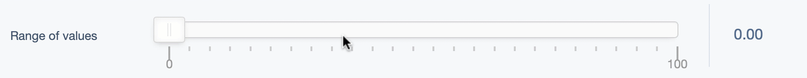

[](https://circleci.com/gh/Firesphere/silverstripe-rangefield)
[](https://codecov.io/gh/Firesphere/silverstripe-rangefield)
[](https://scrutinizer-ci.com/g/Firesphere/silverstripe-rangefield/?branch=master)

[](https://enjoy.gitstore.app/repositories/Firesphere/silverstripe-rangefield)

# Range field

Play with ranges in your forms in SilverStripe.



# Installation

```sh
composer require firesphere/rangefield
```

# Usage

```php
use Firesphere\RangeField\RangeField;
use SilverStripe\CMS\Model\SiteTree;

class Page extends SiteTree
{
   private static $db = [
      'RangeValues' => 'Varchar',
   ];

   public function getCMSFields()
   {
      $fields = parent::getCMSFields();

      $fields->addFieldToTab(
         'Root.Main',
         RangeField::create('RangeValues', 'Range of values')
      );

      return $fields;
   }
}
```

More complex configuration (including range options):

```php
RangeField::create(
   $field = 'RangeValues',
   $title = 'Range of values',
   $start = 0,
   $min = 0,
   $max = 100,
   $range = [
      'min' => 0, // this will override $min
      '25%' => 25,
      '50%' => 50,
      '75%' => 75,
      'max' => 100,  // this will override $max
   ],
   $value = 33
)
```

The field uses [noUiSlider](https://refreshless.com/nouislider), so you can find [more information there](https://github.com/leongersen/noUiSlider).

When you change the number of handlers on a field, the values are reset, because it's impossible to determine which of the default values is supposed to be the original value.

Selections are stored as a comma-separated set of values, e.g. `33.00,50.00` You'll need to apply your own logic to use the given values in the frontend.

Limited formatting can be applied to the value via the `setUnit()`, `setDecimalPlace()`, and `setFormat()` methods.

# Options

| Option        | Default   | Method              | Usage                                                   |
| ------------- | --------- | ------------------- | ------------------------------------------------------- |
| Snap          | `false`   | `setSnap()`         | Set snapping to points                                  |
| Data          | `[]`      | `setData()`         | Override the generated data                             |
| Max           | `0`       | `setMax()`          | Change the maximum value⍟                               |
| Min           | `100`     | `setMin()`          | Change the minimum value⍟                               |
| Density       | `5`       | `setDensity()`      | Set the density of the pips                             |
| Range         | `[]`      | `setRange()`        | Set the range values⍟                                   |
| Start         | `[0]`     | `setStart()`        | Set the default value⍟                                  |
| Step          | `null`    | `setStep()`         | Set the step size                                       |
| Show Pips     | `true`    | `setShowPips()`     | Show or hide the pips                                   |
| Snap          | `false`   | `setSnap()`         | Snap to the range-set values instead of fluid           |
| Unit          | `''`      | `setUnit()`         | Append a unit to the output value                       |
| Decimal Place | `2`       | `setDecimalPlace()` | Format the number of decimal places in the output value |
| Format        | `''`, `2` | `setFormat()`       | A shortcut for setting both units and decimal places    |

⍟ These items can be set in the construct/create method

# Known issues

- Multiple start values seem not to work properly
- Slider starts at minimum rather than current value after publish

# License

This module is published under BSD 3-clause license, although these are not in the actual classes, the license does apply:

http://www.opensource.org/licenses/BSD-3-Clause

```
Copyright (c) 2012-NOW(), Simon "Firesphere" Erkelens

All rights reserved.

Redistribution and use in source and binary forms, with or without modification, are permitted provided that the following conditions are met:

- Redistributions of source code must retain the above copyright notice, this list of conditions and the following disclaimer.

- Redistributions in binary form must reproduce the above copyright notice, this list of conditions and the following disclaimer in the documentation and/or other materials provided with the distribution.

THIS SOFTWARE IS PROVIDED BY THE COPYRIGHT HOLDERS AND CONTRIBUTORS "AS IS" AND ANY EXPRESS OR IMPLIED WARRANTIES, INCLUDING, BUT NOT LIMITED TO, THE IMPLIED WARRANTIES OF MERCHANTABILITY AND FITNESS FOR A PARTICULAR PURPOSE ARE DISCLAIMED. IN NO EVENT SHALL THE COPYRIGHT HOLDER OR CONTRIBUTORS BE LIABLE FOR ANY DIRECT, INDIRECT, INCIDENTAL, SPECIAL, EXEMPLARY, OR CONSEQUENTIAL DAMAGES (INCLUDING, BUT NOT LIMITED TO, PROCUREMENT OF SUBSTITUTE GOODS OR SERVICES; LOSS OF USE, DATA, OR PROFITS; OR BUSINESS INTERRUPTION) HOWEVER CAUSED AND ON ANY THEORY OF LIABILITY, WHETHER IN CONTRACT, STRICT LIABILITY, OR TORT (INCLUDING NEGLIGENCE OR OTHERWISE) ARISING IN ANY WAY OUT OF THE USE OF THIS SOFTWARE, EVEN IF ADVISED OF THE POSSIBILITY OF SUCH DAMAGE.
```

# Did you read this entire readme? You rock!

Pictured below is a cow, just for you.

```
               /( ,,,,, )\
              _\,;;;;;;;,/_
           .-"; ;;;;;;;;; ;"-.
           '.__/`_ / \ _`\__.'
              | (')| |(') |
              | .--' '--. |
              |/ o     o \|
              |           |
             / \ _..=.._ / \
            /:. '._____.'   \
           ;::'    / \      .;
           |     _|_ _|_   ::|
         .-|     '==o=='    '|-.
        /  |  . /       \    |  \
        |  | ::|         |   | .|
        |  (  ')         (.  )::|
        |: |   |;  U U  ;|:: | `|
        |' |   | \ U U / |'  |  |
        ##V|   |_/`"""`\_|   |V##
           ##V##         ##V##
```
